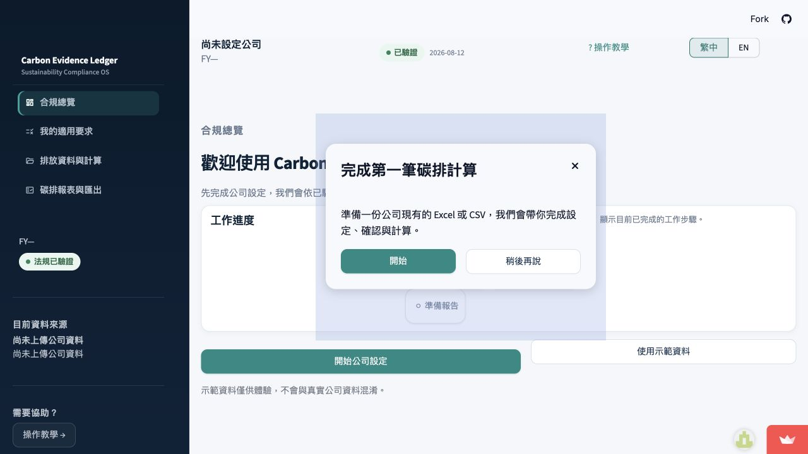
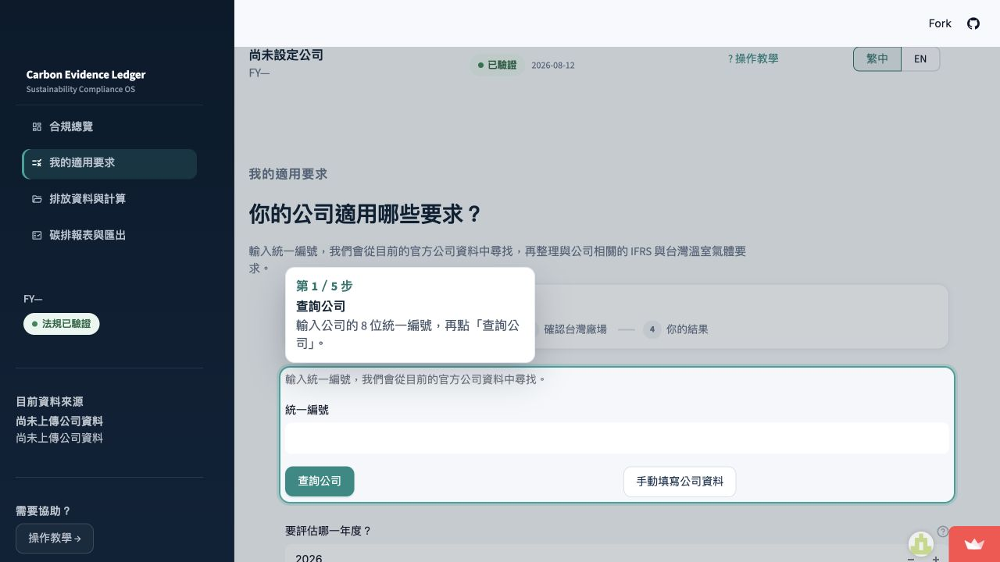

# Carbon Evidence Ledger for Taiwanese Exporters

**Chinese working title:** 台灣出口商碳資料證據帳本與法規映射系統

**Python package:** `carbon_ledger`

An open-source research and portfolio project exploring how synthetic Taiwanese
exporter activity records can be organized into traceable evidence, limited
emissions calculations, and regulatory data-readiness mappings.

**Live app:** [carbon-evidence-ledger-tw.streamlit.app](https://carbon-evidence-ledger-tw.streamlit.app/)

## Product preview

### Guided onboarding



### Company applicability workflow



## Purpose

Companies often store operational information across utility bills, invoices,
fuel records, transport documents, production logs, and spreadsheets. A single
emissions total is not enough for sustainability work. This project focuses on
**evidence lineage**: where each number came from, which document supports it,
which emission-factor and rule versions were used, what the record may and may
not be used for, and whether a human should review it.

## Scenario

The first public MVP uses a fictional Taiwanese steel-fastener exporter:

**Demo Fasteners Taiwan Ltd. (Synthetic)**

The company manufactures products such as screws, nuts, and bolts. Selected
products may fall under CN 7318 in the synthetic demonstration only. Product
names alone are not treated as formal customs classification.

## Current scope and roadmap

The v0.1.0 public release focuses on traceable evidence intake, data validation,
limited emissions calculations, and a guided workflow for a synthetic Taiwanese
exporter scenario. Framework-related features have different maturity levels:

- **GHG Protocol** — technical Scope 1 / 2 / 3 mapping for supported synthetic
  activity records is available now.
- **Taiwan regulatory applicability** — the web app provides guided screening
  based on registered reference records, but does not make a legal determination.
- **EU CBAM** — an experimental data-role mapping is available for a simplified
  steel-fastener scenario. A complete declaration, embedded-emissions workflow,
  and certificate calculation remain future work.
- **IFRS S2** — experimental climate-data readiness signals are available. Full
  disclosures, compliance assessment, and assurance remain outside the current
  release.

## Available in v0.1.0

- guided Traditional Chinese / English web workflow
- CSV and XLSX evidence intake with source traceability
- schema validation, unit normalization, and data-quality exceptions
- versioned emission-factor and regulatory reference records
- auditable reference-sync workflow with human validation before activation
- deterministic factor matching and calculation-readiness checks
- limited emissions calculations where configured factors are available
- technical GHG Protocol mapping for supported records
- optional experimental EU CBAM and IFRS S2 readiness mappings
- reproducible pipeline outputs and downloadable audit bundles

This is a public research and demonstration release, not production compliance
software.

## Technology stack

- Python 3.11+ (local development may use Python 3.13)
- pandas, DuckDB, Pandera
- Streamlit
- pytest, Ruff
- Git and GitHub Actions

## Installation (macOS)

From the repository root:

```bash
python3 -m venv .venv
source .venv/bin/activate
python -m pip install -U pip
make install
```

Or without Make:

```bash
python -m pip install -e ".[dev]"
```

Copy the environment example if you need a local `.env` later:

```bash
cp .env.example .env
```

## Public web app

Open the public application:

<https://carbon-evidence-ledger-tw.streamlit.app/>

Launch the Streamlit application from the repository root:

```bash
streamlit run streamlit_app.py
```

The UI uses the same tested pipeline and does not implement separate accounting
logic. The interface now includes:

- Traditional Chinese / English localization (Traditional Chinese default)
- first-time tutorial and glossary
- beginner-first explanations with progressive technical disclosure
- dashboard navigation and a compact workflow overview
- status and classification charts generated from current results
- structured company-data intake (CSV/XLSX upload, mapping, and validation)

Visitors start with an empty customer workspace and a guided first-run tutorial.
Synthetic demonstration data are loaded only after the visitor explicitly
selects the demo option. The public navigation includes:

- **合規總覽 / Compliance overview** — setup progress and a concise status view
- **我的適用要求 / Applicability** — guided company setup and requirement mapping
- **排放資料與計算 / Emissions data and calculation** — CSV/XLSX intake,
  mapping, validation, analysis, and review
- **碳排報表與匯出 / Emissions reports and export** — customer-facing results
  and auditable downloads

### Structured company-data intake

The current release supports:

- CSV and XLSX uploads (10 MB limit)
- column mapping and activity/unit value mapping
- schema validation with accepted/rejected preview
- source-file SHA-256 provenance and deterministic record IDs

Uploaded data are processed in memory and are not committed to Git.

PDF invoice extraction and uploaded-data carbon calculation are **not**
implemented in the current release and remain planned work.

The workflow remains a synthetic demonstration and should not be treated as
production compliance software.

## Official reference sync

Official government factors are maintained through an auditable sync layer.
Normal analysis stays offline and never auto-activates newly downloaded values.

```bash
python -m carbon_ledger references check
python -m carbon_ledger references fetch --retrieved-at 2026-08-10T00:00:00Z
python -m carbon_ledger references validate
python -m carbon_ledger references status
```

See `docs/official_reference_sync.md`.

## Quick Demo

Run the synthetic end-to-end demo with all optional adapters:

```bash
python -m carbon_ledger run-demo \
  --run-id portfolio_demo \
  --all-adapters
```

Outputs are written to:

```text
outputs/portfolio_demo/
```

That directory contains CSV result tables and `manifest.json`. Generated
`outputs/` artifacts are ignored by Git.

Core-only demo:

```bash
python -m carbon_ledger run-demo --run-id core_demo
```

## Verify

```bash
make version
make test
make lint
make check
```

Expected version output:

```text
0.1.0
```

## Synthetic-data policy

Company-level and regulatory references are based on public sources.
Activity-level records are synthetic and used only to test the data pipeline.
They are not presented as actual company operational data.

No real company is named in the public synthetic dataset. Every synthetic
document will carry an explicit synthetic-data marker. Real source data from
any future private pilot must stay out of Git.

## Important current limits

- Natural gas and diesel remain blocked until applicable verified heating
  values exist
- Purchased steel still has no configured calculation factor
- CN 7318 is a demonstration assumption, not a formal customs determination
- CBAM is an optional downstream adapter
- IFRS S2 evaluation is readiness only, not a compliance assessment
- The v0.1.0 public release is not production-ready

## Limitations and disclaimer

This project is not legal, customs, assurance, or compliance advice.
It does not determine CBAM certificate liability or IFRS S2 compliance.
Product CN codes and regulatory mappings are simplified for educational and
technical demonstration purposes and require professional review before
real-world use.

## License

MIT — see [LICENSE](LICENSE).
